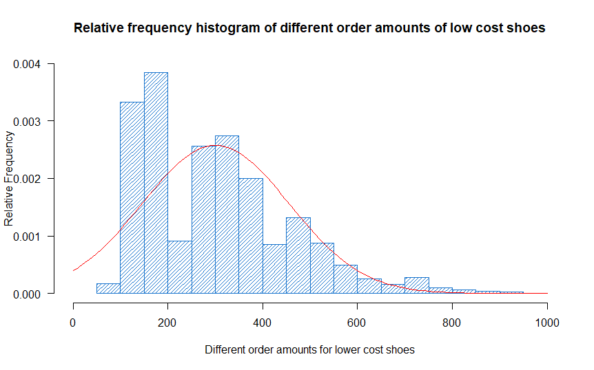

# Shopify Data Science Intern Challenge

## Question 1:
a. So to solve this question, I will be using R as an analysis tool.

First, I decided to get some necessary information about what's going on, by looking at the five number summary, of lowest, first quartile, median, third quartile and highest values. I got the following: `90  163  284  390  704000`. This means that while 75% is within 90 and 390, that an extra 25% of the shoe costs remain in the range of 390 to 704000. Examining the skewness (which way is its tail at) of `16.67003` tells us its right tail is pretty long, and kurtosis (measure of how big the tails are) of `282.6205` support this fact.

This analysis tells us that there are likely two separate distributions that we've combined together. One where at least 75% of shoe stores fall under, a cheaper shoe store brand, compared to the other 25% (at most) of shoe stores are super high end and really expensive.

This tracks with the problem definition of the AOV being really high, since long tails to the right tend to bring the sample mean up a lot. It also tracks with shoe stores selling one brand of shoe, this means that there are those higher end shoe stores that we need to consider in a distribution of their own.

So, to continue analyzing this, I will attempt to split the data up into two partitions where their five number summary makes sense.

In order to do this, I just simply partitioned the data based on the quartiles. After doing this, I got the following five numbers for the top 25%: `392  459  507  591  704000` still very skewed. After a double check with kurtosis and skewness, I decided to partition it one more time, 87.5 and 12.5% splits.

This is when I got the next five numbers for the top 12.5%: `592  652  712  935  704000` - still very skewed again. Checking with kurtosis and skewness as well (looking for close to 3 kurtosis, close to 0 skewness), I decided to do one final partition based off of 935.

This is when I did the final step, where the data is split in terms of 93.5% is low cost, and 6.5% is high cost. Its five numbers were pretty reasonable for high cost shoes: `948.0  25725.0  51450.0  90037.5 704000.0`, and the split makes sense for the low cost shoes as well.

You can see here:  that while the normal distribution doesn't follow the low cost that well, the evidence of a kurtosis close to 3 (`3.596285`) and a low skewness (`0.9399418`) suggest a normal distribution, and a mean value that can be taken. Similar numbers for the high cost (skewness: `1.293732` and kurtosis: `2.721902`) suggest a similar analysis.

b. I would suggest based on the evidence above, to take two metrics, the expected values of both the low cost shoes and high cost shoes.

c. The mean that was calculated ended up being `300.5241` for low cost shoes, and `187454` for high-end shoes, which tracks with general knowledge of how much shoes should cost.

## Question 2:
a. 

Query: `SELECT COUNT(*) FROM Orders JOIN Shippers ON Orders.ShipperID = Shippers.ShipperID WHERE Shippers.ShipperName = "Speedy Express";`

Total Orders: `54`

b.

Query: `SELECT Employees.LastName FROM Orders LEFT JOIN Employees ON Orders.EmployeeID = Employees.EmployeeID GROUP BY Orders.EmployeeID ORDER BY COUNT(OrderID) DESC LIMIT 1`

Last Name: `Peacock`

c.

Getting the product ordered most:
`SELECT SUM(Quantity), * FROM [OrderDetails] GROUP BY ProductID ORDER BY SUM(Quantity) DESC`

Getting customers in germany:
`SELECT * FROM [Customers] WHERE Country = "Germany"`

Getting the orders related to the customers in germany:
`SELECT * FROM Orders JOIN Customers ON Orders.CustomerID = Customers.CustomerID WHERE Customers.Country = "Germany"`

Getting the order details related to those customers in germany:
`SELECT * FROM Orders JOIN Customers ON Orders.CustomerID = Customers.CustomerID JOIN OrderDetails ON OrderDetails.OrderID = Orders.OrderID WHERE Customers.Country = "Germany"`

Getting the order details + quantity in reverse order:
`SELECT SUM(OrderDetails.Quantity), * FROM Orders LEFT JOIN Customers ON Orders.CustomerID = Customers.CustomerID JOIN OrderDetails ON OrderDetails.OrderID = Orders.OrderID WHERE Customers.Country = "Germany" GROUP BY ProductID ORDER BY SUM(OrderDetails.Quantity) DESC`

Joining one more time for product name:
`SELECT SUM(OrderDetails.Quantity), * FROM Orders LEFT JOIN Customers ON Orders.CustomerID = Customers.CustomerID JOIN OrderDetails ON OrderDetails.OrderID = Orders.OrderID JOIN Products ON OrderDetails.ProductID = Products.ProductID WHERE Customers.Country = "Germany" GROUP BY OrderDetails.ProductID ORDER BY SUM(OrderDetails.Quantity) DESC`

Final One:
`SELECT Products.ProductName FROM Orders LEFT JOIN Customers ON Orders.CustomerID = Customers.CustomerID JOIN OrderDetails ON OrderDetails.OrderID = Orders.OrderID JOIN Products ON OrderDetails.ProductID = Products.ProductID WHERE Customers.Country = "Germany" GROUP BY OrderDetails.ProductID ORDER BY SUM(OrderDetails.Quantity) DESC LIMIT 1`

Surprisingly, it's `Boston Crab Meat`!
